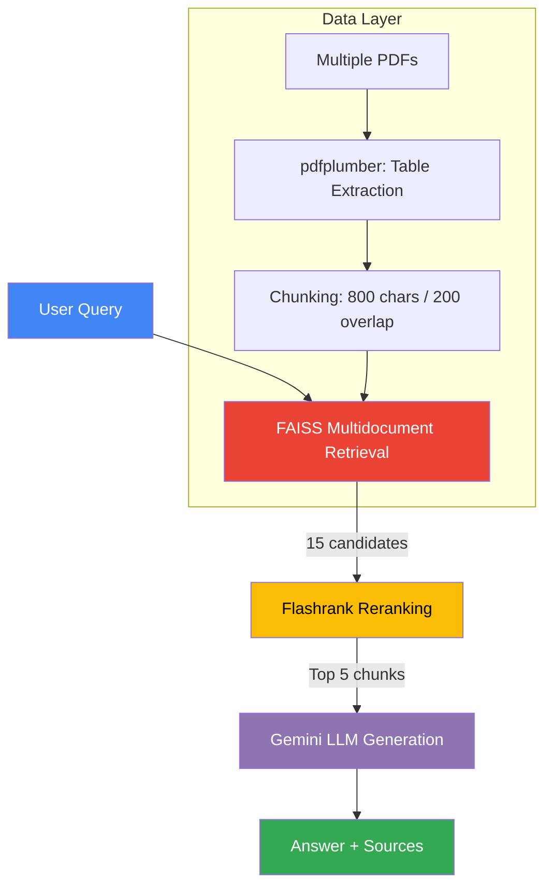

# 🤖 RAG Agent — Multidocument Nutritional Labeling (Argentina)

<p align="center">
  
  
  
</p>

<p align="center">
  
  
  
  
  
  
  
</p>

**Multidocument conversational agent with Retrieval Augmented Generation (RAG)** for querying Argentine front-of-pack nutritional labeling regulations (Law 27.642 and Decree 151/2022). Designed to scale across multiple regulatory documents.

- 🔍 Local retrieval (FAISS + HuggingFace embeddings, zero cloud costs)
- 🧠 Generation via Gemini API (free tier, no credits required)
- 📄 Multidocument ingestion — index and query across multiple PDFs simultaneously
- 📊 Evaluated with RAGAS — Score: 0.862 (Faithfulness 1.0)
- ⚡ FastAPI + Docker ready
- 🎯 Production-ready

---

## 🧩 Architecture Flow



**Multidocument:** Drop multiple PDFs into `data/` — all are indexed and searchable through a single query endpoint.

---

## Tech Stack

| Component | Technology |
|---|---|
| Retrieval | FAISS + HuggingFace embeddings (`sentence-transformers/paraphrase-multilingual-MiniLM-L12-v2`) |
| Reranking | Flashrank (`ms-marco-TinyBERT-L-2-v2`) |
| Table Extraction | pdfplumber |
| LLM | Google Gemini API free tier (`gemini-3.1-flash-lite`) |
| API | FastAPI |
| Evaluation | RAGAS: Faithfulness, Answer Relevancy, Context Precision |
| Version Control | Git + GitHub |

---

## Installation

### Requirements

- Python 3.10+
- pip
- Gemini API key (free tier) from [aistudio.google.com](https://aistudio.google.com/)

```bash
# Clone the repository
git clone https://github.com/bernytech25/rag-agent.git
cd rag-agent

# Create and activate a virtual environment (Windows)
python -m venv .venv
.venv\Scripts\activate

# Create and activate a virtual environment (macOS/Linux)
python3 -m venv .venv
source .venv/bin/activate

# Install dependencies
pip install -r requirements.txt

# Create the environment file
cat > .env <<'ENV'
GEMINI_API_KEY=your-gemini-api-key
GEMINI_MODEL=gemini-3.1-flash-lite
JUDGE_MODEL=gemini-3.1-flash-lite
JWT_SECRET_KEY=change-this-in-production
JWT_EXPIRE_MINUTES=60
ENV
```

---

## Usage

### Local API (FastAPI)

Start the local development server:

```bash
python -m uvicorn app.main:app --reload
```

Open the interactive API documentation at [http://localhost:8000/docs](http://localhost:8000/docs).

#### Example: `POST /ask`

Request:

```json
{
  "question": "What is the sodium limit for the excess sodium warning label?",
  "history": []
}
```

Response:

```json
{
  "answer": "The excess sodium warning label applies when the product exceeds the applicable sodium threshold established by the regulation.",
  "sources": [
    "2024-12-manual_normativa_original..."
  ]
}
```

---

## Evaluation

The agent was evaluated with **RAGAS** using the following metrics:

- **Faithfulness:** 1.0
- **Answer Relevancy**
- **Context Precision**
- **Overall score:** 0.862

The overall RAGAS score of **0.862** reflects the combined evaluation results across the tested questions and contexts. **No threshold applied because TinyBERT compresses scores near 1.0.**

---

### Table Extraction

**pdfplumber** detects tables automatically and converts them to Markdown. This prevents tables from being split by `CHUNK_SIZE`, preserving the regulatory relationships between labels, thresholds, percentages, and numeric limits.

---

### Prompt Guard

`SYSTEM_PROMPT` includes the following explicit rule:

> When citing thresholds, percentages, or numeric limits, use EXACTLY the document's wording. DO NOT rephrase or paraphrase.

This prevents the LLM from misstating numbers.

---

## Roadmap

- [ ] Deploy to Cloud Run
- [ ] Add more regulatory documents (multidocument expansion)
- [ ] Improve Context Precision to 0.75+
- [ ] Implement feedback loop (user validates answers)
- [ ] Production monitoring (query logging)

---

## Credits

- **RAGAS Evaluation:** LangChain framework
- **Prompt engineering:** Collaboration with Kimi
- **Retriever optimization:** Balanced `CHUNK_SIZE`, `TOP_K`, and reranking

---

## License

MIT

---

## Contact

GitHub: https://github.com/bernytech25/rag-agent

---

## Changelog

**v1.0** (2026-07-30)

- [x] Functional RAG with FAISS + Gemini
- [x] RAGAS evaluation 0.862 score
- [x] FastAPI deployed locally
- [x] pdfplumber for table extraction
- [x] Guard prompt against number rephrasing
- [x] Full GitHub push
- [x] Multidocument ingestion support
